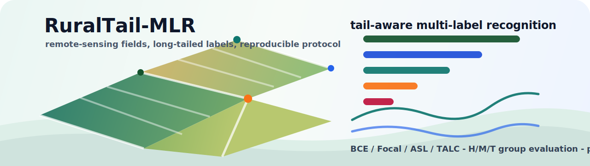

<p align="center">
  
</p>

<h1 align="center">RuralTail-MLR</h1>

<p align="center">
  <strong>TALC code release for long-tailed multi-label remote-sensing recognition.</strong>
</p>

<p align="center">
  <a href="https://github.com/JiajunChen223/RuralTail-MLR/blob/main/LICENSE"></a>
  
  
  
  
</p>

<p align="center">
  <a href="#overview">Overview</a> |
  <a href="#quick-start">Quick Start</a> |
  <a href="#data-interface">Data Interface</a> |
  <a href="#paper-protocol">Paper Protocol</a> |
  <a href="#citation">Citation</a>
</p>

## Overview

RuralTail-MLR is the public code release for **TALC**: tail-aware score learning
and label conversion for long-tailed multi-label rural and agricultural
remote-sensing recognition.

The repository packages the training, evaluation, threshold-freezing, and
paper-table generation path used by the public TALC protocol. Its scope is kept
deliberately clean: raw datasets, model weights, generated reports, and training
outputs are excluded from version control, while all configs, launchers, tests,
and reproduction utilities are included.

| Area | What is included |
| --- | --- |
| Score sources | `BCE`, `Focal`, `ASL`, and `TALC` |
| Operating rules | Formal fixed `0.5` (`-F`) and validation-selected H/M/T group (`-G`) variants |
| Paper metrics | `mAP`, `Macro-F1`, `Tail mAP`, `Tail P`, `Tail R`, `Tail F1` |
| Main protocol | China-MAS-50k with six paper carriers |
| Second dataset | Agriculture-Vision-2021 with three paper carriers |
| Diagnostics | Global and classwise threshold searches, kept out of public method rows |

TALC is implemented internally by the config id `asl_softf1_t`, while public
tables and documents display it as `TALC`. The TALC SoftF1 term uses a
mini-batch stable estimator: classes with no positive examples in the current
mini-batch are skipped for that batch's SoftF1 estimate while the train-only
H/M/T grouping remains fixed.

## Protocol Map


## Repository Layout

```text
configs/          Hydra configs plus configs/protocol/paper_talc.yaml
data/             Empty placeholders for raw and processed metadata
scripts/          Public paper-protocol launchers and paper diagnostic utilities
src/ruraltail_mlr Core package
tests/            Pytest checks for data, losses, metrics, configs, and protocol
tools/            Data preparation, training, evaluation, manifest, and table tools
outputs/runs/     Training outputs, ignored except for placeholders
artifacts/        Reports, generated manifests, paper tables, and logs
```

## Quick Start

Create the environment:

```bash
conda env create -f environment.yml
conda activate ruraltail-mlr
pip install -r requirements-dev.txt
python tools/check_environment.py --require_timm
```

Install the optional MLM-R18 carrier dependencies only when that carrier is
needed:

```bash
pip install -r requirements-mamba.txt
python tools/check_environment.py --require_mamba_ssm --require_causal_conv1d
```

Run the test suite:

```bash
pytest -q
```

## Data Interface

China-MAS-50k metadata is expected at:

```text
data/processed/images_index.csv
data/processed/labels_clean.csv
data/processed/fixed_split.csv
data/processed/class_mapping.json
data/processed/class_frequency.csv
data/processed/head_medium_tail.json
```

The public preparation script creates an 80/10/10 fixed split with seed
`20260425`.

Agriculture-Vision-2021 metadata is expected at:

```text
data/processed/agriculture_vision_2021/images_index.csv
data/processed/agriculture_vision_2021/labels_clean.csv
data/processed/agriculture_vision_2021/fixed_split.csv
data/processed/agriculture_vision_2021/class_mapping.json
data/processed/agriculture_vision_2021/class_frequency.csv
data/processed/agriculture_vision_2021/head_medium_tail.json
```

The public preparation script uses the official labeled train/validation pool,
splits by field identifier at 80/10/10, and uses seed `20260501`.

Prepare datasets after placing the raw archives:

```bash
bash scripts/prepare_china_mas_50k.sh /path/to/China-MAS-50k.7z
bash scripts/prepare_agriculture_vision_2021_labeled.sh /path/to/Agriculture-Vision-2021.tar.gz
```

## Paper Carriers

The China-MAS-50k main protocol uses six carriers:

| Public name | Role |
| --- | --- |
| `RN50` | ResNet-50 baseline carrier |
| `EffV2-S` | EfficientNetV2-S carrier |
| `PVT-B2` | PVTv2-B2 carrier |
| `MOut-S` | MambaOut-S carrier |
| `SFIN-R18` | Paper carrier adapter |
| `MLM-R18` | Paper carrier adapter with optional Mamba dependencies |

The Agriculture-Vision-2021 second-dataset protocol uses `RN50`, `PVT-B2`, and
`MOut-S`. `SFIN-R18` and `MLM-R18` are paper carrier adapters in this codebase,
not separate official upstream implementations.

## Paper Protocol

Train the China-MAS-50k score sources:

```bash
GPU_LIST=0,1,2 bash scripts/train_score_sources_china.sh
```

Train the Agriculture-Vision-2021 score sources:

```bash
GPU_LIST=0,1,2 bash scripts/train_score_sources_agv.sh
```

Training runs write best checkpoints and a single-run fixed `0.5` (`-F`) test
result under `outputs/runs`. Paper-facing carrier and method tables are
generated by the unified evaluation step below, which recomputes both `-F` and
`-G` results from the completed checkpoints.

Build an evaluation manifest from completed score-source runs, evaluate fixed
and validation-selected H/M/T group operating variants, freeze validation
thresholds for test, and summarize results:

```bash
GPU_LIST=0,1,2 bash scripts/evaluate_paper_protocol.sh
```

Generate paper-facing CSV tables:

```bash
bash scripts/reproduce_paper_tables.sh
```

If using an author-provided checkpoint package instead of training from
scratch, place its manifest and checkpoints under the paths recorded in that
package, then pass the manifest explicitly:

```bash
GPU_LIST=0 bash scripts/run_supplement_group_eval.sh --manifest path/to/manifest.json
```

`--allow-legacy-metadata-mismatch` is intentionally off by default and should
only be used for archived internal checkpoints whose class schema has already
been manually verified.

For a compact end-to-end reproduction note, see [REPRODUCE.md](REPRODUCE.md).

## Quality Checks

```bash
pytest -q
ruff check .
```

The repository includes focused tests for data auditing, split generation,
label schemas, losses, metrics, thresholding, model configs, checkpoint loading,
paper tools, and training smoke paths.

## Contributing

Issues, reproduction questions, and focused pull requests are welcome. Please
include the dataset protocol, carrier, score source, operating rule, command,
and environment details when reporting a reproduction problem. See
[CONTRIBUTING.md](CONTRIBUTING.md) for the short contribution guide.

## Citation

If this repository is useful for your research, please cite it through
[CITATION.cff](CITATION.cff). A BibTeX entry can be generated from the
repository citation metadata on GitHub.

## License

This project is released under the terms of the [MIT License](LICENSE).
